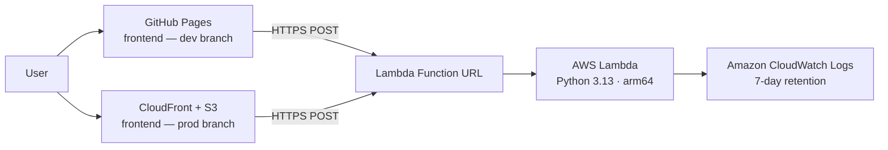

# Bousbi's Tiny Tale Machine ☁️✨

> *A bedtime story, just for you — no AI, no database, no fuss.*

A serverless app that generates personalised bedtime stories for children. Type a name, pick an animal, a place, and a mood — and a unique story appears in seconds.

Built for the **AWS Builder Center Weekend Creative Challenge**, and inspired by my daughter Anastasia — our little "Bousbi" 🐑 — and by my wish to combine a new chapter of motherhood with serverless learning.

🌐 **Live demo (dev):** [mtzanida.github.io/bousbis-tiny-tale-machine](https://mtzanida.github.io/bousbis-tiny-tale-machine/)

---

## ✨ How stories are made

Each story is assembled from five hand-written narrative fragments, picked at random and personalised with the child's name, animal, and place:

```
Opening  →  Adventure  →  Challenge  →  Solution  →  Ending
```

The four moods — **magical**, **calming**, **funny**, and **adventurous** — each have their own distinct set of openings, challenges, and endings. No two stories are the same, and nothing is ever stored.

---

## 🏗️ Architecture



| Layer | dev branch | prod branch |
|---|---|---|
| Frontend hosting | GitHub Pages | S3 + CloudFront |
| Domain | `mtzanida.github.io/…` | Your custom domain |
| Lambda URL | dev GitHub Environment var | production GitHub Environment var |
| Deploy trigger | push to `dev` | push to `prod` |
| Terraform | Lambda only | Lambda + S3 + CloudFront + IAM |

---

## 📁 Project structure

```text
.
├── .github/
│   └── workflows/
│       ├── deploy-pages.yml      # dev branch → GitHub Pages
│       ├── deploy-s3.yml         # prod branch → S3 + CloudFront
│       ├── protect-main.yml      # blocks direct pushes to main
│       ├── terraform-validate.yml
│       ├── cost-monitor.yml
│       └── security-scan.yml
├── frontend/
│   ├── index.html
│   ├── style.css
│   ├── config.js                 # ⚠ auto-generated at deploy time — do not edit
│   └── app.js
├── lambda/
│   ├── lambda_function.py
│   └── test_lambda_function.py
├── terraform/
│   ├── main.tf                   # AWS provider + tags
│   ├── lambda.tf                 # Lambda function + Function URL
│   ├── cloudwatch.tf             # Log group
│   ├── s3.tf                     # Frontend S3 bucket (prod)
│   ├── cloudfront.tf             # CloudFront distribution (prod)
│   ├── iam.tf                    # Lambda role + GitHub OIDC role (prod)
│   ├── variables.tf
│   ├── outputs.tf
│   ├── versions.tf
│   └── tfvars/
│       ├── dev.tfvars            # ← gitignored, fill in locally
│       └── prod.tfvars           # ← gitignored, fill in locally
└── README.md
```

---

## 🔑 How `config.js` works

`config.js` is **never hardcoded** in the repository. Both deploy workflows write it fresh on every run using the `LAMBDA_URL` **secret** from the matching GitHub Environment:

```
dev  environment  →  LAMBDA_URL = https://your-dev-lambda-url.aws/
prod environment  →  LAMBDA_URL = https://your-prod-lambda-url.aws/
```

This means you get environment-specific Lambda URLs without any secrets in the codebase — exactly like `.env` files, but managed by GitHub. Because `LAMBDA_URL` is stored as a **secret** (not a variable), GitHub masks it in workflow logs and never exposes it via the API.

---

## 🚀 Deploy it yourself

### Prerequisites

- AWS account with programmatic access
- [AWS CLI v2](https://docs.aws.amazon.com/cli/latest/userguide/getting-started-install.html)
- [Terraform](https://developer.hashicorp.com/terraform/install) ≥ 1.6
- A GitHub account with this repository forked

---

### Step 1 — Deploy the Lambda backend with Terraform

```bash
cd terraform
terraform init
terraform plan -var-file="tfvars/dev.tfvars"   # review
terraform apply -var-file="tfvars/dev.tfvars"  # deploy
```

Note the `lambda_function_url` from the output — you'll need it in the next step.

---

### Step 2 — Configure GitHub Environments

Go to your repository → **Settings → Environments** and create two environments:

#### `dev` environment

| Type | Name | Value |
|---|---|---|
| Secret | `LAMBDA_URL` | the Lambda Function URL from terraform output |

#### `production` environment

| Type | Name | Value |
|---|---|---|
| Secret | `AWS_ROLE_ARN` | GitHub Actions IAM role ARN (from `terraform output github_actions_role_arn`) |
| Secret | `LAMBDA_URL` | the prod Lambda Function URL |
| Variable | `BUCKET_NAME` | S3 bucket name (from `terraform output s3_bucket_name`) |
| Variable | `AWS_REGION` | e.g. `eu-central-1` |
| Variable | `DOMAIN_NAME` | your custom domain (optional, for the summary message) |

---

### Step 3 — Set up branches

```bash
git checkout -b dev
git push -u origin dev

git checkout -b prod
git push -u origin prod
```

Go to **Settings → Pages** and set the source to **GitHub Actions** (needed for the `dev` branch Pages deployment).

---

### Step 4 — Push and deploy

- Push to `dev` → GitHub Pages deploys automatically with the dev Lambda URL
- Push to `prod` → S3 + CloudFront deploys automatically with the prod Lambda URL

---

### Step 5 — Connect your custom domain (prod, when ready)

1. Request a certificate in **ACM** in `us-east-1` (required for CloudFront)
2. Validate it with a CNAME DNS record
3. In `terraform/cloudfront.tf`, uncomment the `aliases` and `viewer_certificate` lines and fill in your values
4. In `terraform/tfvars/prod.tfvars`, uncomment and fill in `domain_name` and `certificate_arn`
5. Run `terraform apply -var-file="tfvars/prod.tfvars"`
6. Point your domain's DNS to the CloudFront distribution domain name

---

## 🧪 Test locally

```bash
cd lambda
python3 -m unittest -v
```

Test the deployed Lambda directly:

```bash
curl -X POST "YOUR_LAMBDA_FUNCTION_URL" \
  -H "Content-Type: application/json" \
  -d '{"name":"Anastasia","animal":"tiny blue elephant","place":"the Castle Above the Clouds","mood":"magical"}'
```

---

## 🔒 Security and cost notes

- **No long-lived AWS keys** — GitHub Actions authenticates with OIDC (scoped to the `prod` branch)
- **Private S3 bucket** — all traffic goes through CloudFront; the bucket has public access blocked
- **Least-privilege Lambda role** — only `AWSLambdaBasicExecutionRole` (write logs)
- **No data persistence** — no story or personal detail is ever stored
- **Cost** — Lambda free tier covers 1 million requests/month; S3 + CloudFront usage for a low-traffic demo is negligible

---

## 🗑️ Tear down

```bash
cd terraform
terraform destroy -var-file="tfvars/prod.tfvars"
```

This removes Lambda, IAM roles, S3 bucket, CloudFront distribution, and CloudWatch log group. GitHub Pages is free and can stay up indefinitely.

---

## 👩‍💻 Author

**Maria Tzanidaki** — AWS Community Builder, Serverless  
[GitHub](https://github.com/mtzanida)

---

## License

[MIT](LICENSE)
