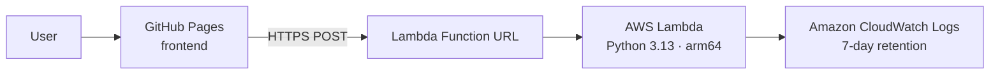

# Bousbi's Tiny Tale Machine ☁️✨

> *A bedtime story, just for you — no AI, no database, no fuss.*

A serverless app that generates personalised bedtime stories for children. Type a name, pick an animal, a place, and a mood — and a unique story appears in seconds.

Built for the **AWS Builder Center Weekend Creative Challenge**, and inspired by my daughter Anastasia — our little "Bousbi" 🐑 — and by my wish to combine a new chapter of motherhood with serverless learning.

🌐 **Live demo:** [mtzanida.github.io/bousbis-tiny-tale-machine](https://mtzanida.github.io/bousbis-tiny-tale-machine/)

---

## ✨ How stories are made

Each story is assembled from five hand-written narrative fragments, picked at random and personalised with the child's name, animal, and place:

```
Opening  →  Adventure  →  Challenge  →  Solution  →  Ending
```

The four moods — **magical**, **calming**, **funny**, and **adventurous** — each have their own distinct set of openings, challenges, and endings. No two stories are the same, and nothing is ever stored.

---

## 🏗️ Architecture



| Layer | Technology |
|---|---|
| Frontend | HTML + CSS + vanilla JS, hosted on GitHub Pages |
| Backend | AWS Lambda (Python 3.13, arm64, 128 MB, 5 s timeout) |
| Endpoint | Lambda Function URL — no API Gateway needed |
| Logs | Amazon CloudWatch Logs (7-day retention) |
| IAM | Least-privilege execution role |
| IaC | Terraform ≥ 1.6 |
| CI/CD | GitHub Actions — auto-deploys frontend on every push |

---

## 📁 Project structure

```text
.
├── .github/
│   └── workflows/
│       └── deploy-pages.yml      # Auto-deploys frontend to GitHub Pages
├── frontend/
│   ├── index.html                # Story form and result display
│   ├── style.css                 # Styling
│   ├── config.js                 # Lambda URL (set after terraform apply)
│   └── app.js                   # Fetch call and DOM logic
├── lambda/
│   ├── lambda_function.py        # Story generator + Lambda handler
│   └── test_lambda_function.py  # Unit tests
├── terraform/
│   ├── main.tf                   # All AWS resources
│   ├── variables.tf
│   ├── outputs.tf
│   └── versions.tf
└── README.md
```

---

## 🚀 Deploy it yourself

### Prerequisites

- An AWS account with programmatic access configured
- [AWS CLI v2](https://docs.aws.amazon.com/cli/latest/userguide/getting-started-install.html)
- [Terraform](https://developer.hashicorp.com/terraform/install) ≥ 1.6
- Git and a GitHub account

### 1. Fork or clone this repository

```bash
git clone https://github.com/mtzanida/bousbis-tiny-tale-machine.git
cd bousbis-tiny-tale-machine
```

### 2. Configure AWS access

```bash
aws configure          # enter your access key, secret, and region (e.g. eu-central-1)
aws sts get-caller-identity   # verify it works
```

The IAM user needs permissions to create Lambda, IAM roles, and CloudWatch log groups. See [Security notes](#-security-and-cost-notes) for the minimum policy.

### 3. Deploy the backend with Terraform

```bash
cd terraform
terraform init
terraform plan
terraform apply        # type yes to confirm
```

Terraform prints the Lambda Function URL when done:

```text
lambda_function_url = "https://xxxxxxxxxxxx.lambda-url.eu-central-1.on.aws/"
```

### 4. Connect the frontend

Open `frontend/config.js` and replace the placeholder with your URL:

```javascript
window.APP_CONFIG = {
  LAMBDA_URL: "https://xxxxxxxxxxxx.lambda-url.eu-central-1.on.aws/"
};
```

Commit and push the change.

### 5. Enable GitHub Pages

1. Go to **Settings → Pages** in your repository.
2. Under **Build and deployment → Source**, select **GitHub Actions**.
3. Open the **Actions** tab and wait for `Deploy frontend to GitHub Pages` to finish.
4. Your site is live at `https://YOUR-USERNAME.github.io/bousbis-tiny-tale-machine/`

Every subsequent push that changes the `frontend/` directory redeploys automatically.

---

## 🧪 Test locally

Run the unit tests:

```bash
cd lambda
python3 -m unittest -v
```

Test the deployed endpoint with curl:

```bash
curl -X POST "YOUR_LAMBDA_FUNCTION_URL" \
  -H "Content-Type: application/json" \
  -d '{"name":"Anastasia","animal":"tiny blue elephant","place":"the Castle Above the Clouds","mood":"magical"}'
```

---

## 🔒 Security and cost notes

- **Public endpoint** — the Function URL has no auth by default so visitors can generate stories without AWS credentials. This is intentional for a public demo.
- **Least-privilege IAM** — the Lambda execution role only has `AWSLambdaBasicExecutionRole` (write logs). Nothing else.
- **Input sanitisation** — all inputs are length-limited and stripped of special characters before use.
- **No data persistence** — no story or personal detail is ever stored anywhere.
- **Cost** — Lambda free tier covers 1 million requests/month. This demo stays well within that under normal traffic. Always monitor your AWS usage.
- **CORS** — `allowed_origin` is set to `*` by default. After deployment, tighten it to your GitHub Pages domain in `terraform/terraform.tfvars`:

```hcl
allowed_origin = "https://YOUR-USERNAME.github.io"
```

Then run `terraform apply` again to update.

---

## 🗑️ Tear down

When you no longer need the backend:

```bash
cd terraform
terraform destroy      # review the plan, then type yes
```

This removes the Lambda function, IAM role, and CloudWatch log group. The GitHub Pages frontend is free and can stay up indefinitely.

---

## 👩‍💻 Author

**Maria Tzanidaki** — AWS Community Builder, Serverless
[GitHub](https://github.com/mtzanida)

---

## License

[MIT](LICENSE)
