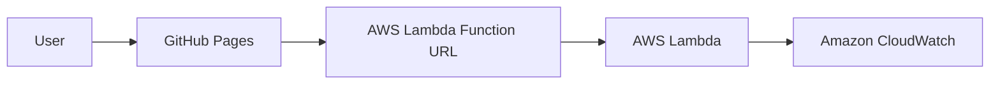

# Bousbi's Tiny Tale Machine ☁️✨

A small serverless application that creates personalised bedtime stories for children. Built for the **AWS Builder Center Weekend Creative Challenge**.

The idea was inspired by my daughter, Anastasia—our little "Bousbi"—and by my wish to combine a new chapter of motherhood with serverless learning.

## Architecture



The frontend is hosted for free on GitHub Pages. The story generator runs on AWS Lambda and is exposed through a Lambda Function URL. Terraform provisions all AWS resources.

## AWS resources

- **AWS Lambda** — runs the Python story generator.
- **AWS IAM** — provides a least-purpose execution role for Lambda.
- **Amazon CloudWatch Logs** — stores function logs for seven days.
- **Lambda Function URL** — provides the public HTTPS endpoint with CORS.

No database, API Gateway, AI model, or paid third-party API is required. Stories are generated in memory and are never stored.

## Prerequisites

- An AWS account
- [AWS CLI](https://docs.aws.amazon.com/cli/latest/userguide/getting-started-install.html)
- [Terraform](https://developer.hashicorp.com/terraform/install) 1.6+
- Git and a GitHub account

## 1. Configure AWS access

Use an AWS CLI profile or AWS IAM Identity Center. Check that access works:

```bash
aws sts get-caller-identity
```

Do not add AWS access keys to this repository.

## 2. Deploy the backend with Terraform

```bash
cd terraform
terraform init
terraform fmt -check
terraform validate
terraform plan
terraform apply
```

Confirm by typing `yes`. Terraform prints an output similar to:

```text
lambda_function_url = "https://example.lambda-url.eu-central-1.on.aws/"
```

Copy that complete URL.

## 3. Connect the frontend

Open `frontend/config.js` and replace:

```javascript
LAMBDA_URL: "PASTE_YOUR_LAMBDA_FUNCTION_URL_HERE"
```

with the URL returned by Terraform:

```javascript
LAMBDA_URL: "https://example.lambda-url.eu-central-1.on.aws/"
```

Commit and push the change.

## 4. Publish with GitHub Pages

1. Open the repository on GitHub.
2. Go to **Settings → Pages**.
3. Under **Build and deployment**, choose **GitHub Actions** as the source.
4. Open the **Actions** tab and wait for `Deploy frontend to GitHub Pages` to finish.
5. The live URL will be shown in the successful workflow and in **Settings → Pages**.

Every later push that changes the `frontend` directory deploys automatically.

## Test the backend locally

```bash
cd lambda
python3 -m unittest -v
```

Test the deployed endpoint:

```bash
curl -X POST "YOUR_LAMBDA_FUNCTION_URL" \
  -H "Content-Type: application/json" \
  -d '{"name":"Anastasia","animal":"tiny blue elephant","place":"the Castle Above the Clouds","mood":"magical"}'
```

## Security and cost notes

- The public Function URL is intentional: visitors need to generate stories without AWS credentials.
- The Lambda role only receives AWS's basic logging policy.
- Inputs are length-limited and cleaned before being used.
- No personal data or generated story is persisted.
- The function uses 128 MB memory and a five-second timeout.
- This small demonstration should remain within the Lambda free allowance under normal challenge traffic, but AWS usage should always be monitored.
- Consider changing `allowed_origin` in Terraform from `*` to your final GitHub Pages origin after deployment.

Example:

```hcl
allowed_origin = "https://YOUR-USERNAME.github.io"
```

## Remove the AWS resources

When you no longer want to host the backend:

```bash
cd terraform
terraform destroy
```

Type `yes` only after checking the resources Terraform plans to remove.

## Project structure

```text
.
├── .github/workflows/deploy-pages.yml
├── frontend/
│   ├── index.html
│   ├── style.css
│   ├── config.js
│   └── app.js
├── lambda/
│   ├── lambda_function.py
│   └── test_lambda_function.py
├── terraform/
│   ├── main.tf
│   ├── variables.tf
│   ├── outputs.tf
│   └── versions.tf
└── README.md
```

## Author

**Maria Tzanidaki** — AWS Community Builder, Serverless

## License

MIT
