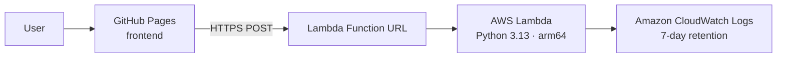

# From Idea to Live App with AWS Free Tier, Terraform, and GitHub — A Practical Walkthrough

*How I built a serverless bedtime story generator for my daughter and ended up with a portfolio piece worth talking about in interviews.*

---

## Why this stack?

Every developer hits the same wall: you have an idea, you want to build something real, but you don't want an AWS bill surprise or a complicated setup that takes days to understand.

This is the stack that solves that:

- **AWS Lambda + Function URL** — runs your backend, scales to zero, costs nothing under normal traffic
- **GitHub Pages** — hosts your frontend for free, forever
- **Terraform** — describes your infrastructure as code so you can recreate, share, or destroy it in minutes
- **GitHub Actions** — deploys your frontend automatically on every push

Together they give you a production-grade architecture with a €0 monthly bill for a demo or side project. More importantly, they give you something concrete to discuss in technical interviews.

---

## The project: Bousbi's Tiny Tale Machine

The app I built for this walkthrough is a personalised bedtime story generator for children. You type a name, pick an animal, a place, and a mood — and a unique story appears in seconds.

It was inspired by my daughter Anastasia, our little "Bousbi" 🐑, and by my wish to combine a new chapter of motherhood with serverless learning. I built it for the **AWS Builder Center Weekend Creative Challenge**.

🌐 Live demo: [mtzanida.github.io/bousbis-tiny-tale-machine](https://mtzanida.github.io/bousbis-tiny-tale-machine/)  
📂 Source code: [github.com/mtzanida/bousbis-tiny-tale-machine](https://github.com/mtzanida/bousbis-tiny-tale-machine)

---

## The architecture in plain English

```
Browser → GitHub Pages (frontend) → Lambda Function URL → AWS Lambda (Python) → CloudWatch Logs
```

The user fills in a form. The frontend sends a POST request to a Lambda Function URL — a direct HTTPS endpoint that AWS generates for your function, no API Gateway needed. Lambda runs your code, returns the response, and CloudWatch quietly logs everything for 7 days. That's it.

No servers. No databases. No always-on processes.



| Layer | Technology | Cost |
|---|---|---|
| Frontend | GitHub Pages | Free |
| Backend | AWS Lambda (128 MB, 5s timeout) | Free tier |
| Endpoint | Lambda Function URL | Free |
| Logs | CloudWatch Logs (7-day retention) | Free tier |
| IaC | Terraform | Free |
| CI/CD | GitHub Actions | Free |

---

## Step 1 — The frontend on GitHub Pages

GitHub Pages hosts static files (HTML, CSS, JS) directly from your repository. It is free for public repos and deploys automatically via GitHub Actions.

The only thing your frontend needs is a `config.js` that holds the Lambda URL:

```javascript
window.APP_CONFIG = {
  LAMBDA_URL: "https://xxxxxxxxxxxx.lambda-url.eu-central-1.on.aws/"
};
```

A GitHub Actions workflow handles deployment automatically:

```yaml
on:
  push:
    branches: [main]
    paths: [frontend/**]

jobs:
  deploy:
    runs-on: ubuntu-latest
    steps:
      - uses: actions/checkout@v4
      - uses: actions/upload-pages-artifact@v3
        with:
          path: frontend/
      - uses: actions/deploy-pages@v4
```

Every time you push a change inside `frontend/`, GitHub rebuilds and republishes the site. Zero manual steps.

**Interview talking point:** *"I used GitHub Actions to automate frontend deployment — any push to the frontend directory triggers a Pages build. No manual uploads, no FTP, no S3 sync scripts."*

---

## Step 2 — The backend on AWS Lambda

Lambda runs your code only when it is called. When there are no requests, nothing runs and nothing costs money. The AWS free tier covers 1 million requests and 400,000 GB-seconds of compute per month — far more than any demo or portfolio project will use.

For this project the function is a single Python file. It receives a JSON body, assembles a story from hand-written fragments, and returns it:

```python
def lambda_handler(event, context):
    body  = json.loads(event.get("body") or "{}")
    name  = clean_text(body.get("name"), "a little dreamer")
    mood  = body.get("mood", "magical")

    paragraphs = [
        random.choice(OPENINGS[mood]).format(name=name),
        random.choice(ADVENTURES).format(name=name, animal=animal, place=place),
        random.choice(CHALLENGES[mood]),
        random.choice(SOLUTIONS).format(name=name, animal=animal),
        random.choice(ENDINGS[mood]).format(name=name),
    ]

    return {
        "statusCode": 200,
        "body": json.dumps({"story": "\n\n".join(paragraphs)})
    }
```

No dependencies, no libraries beyond the standard library, no Docker image. Just a Python file that zips and deploys in seconds.

**Interview talking point:** *"The function is stateless with no external dependencies. Cold starts are under 100ms because there is nothing to initialise. I also set a reserved concurrency limit to cap the blast radius from any traffic spike or abuse."*

---

## Step 3 — Infrastructure as Code with Terraform

This is where most tutorials stop, but it is the part that matters most for interviews. Instead of clicking through the AWS console, you describe your infrastructure in code and commit it to version control.

### File structure

Split your Terraform across focused files — one responsibility per file:

```
terraform/
├── versions.tf      # Terraform version + required providers
├── main.tf          # AWS provider + default tags
├── iam.tf           # Lambda execution role + policy attachment
├── cloudwatch.tf    # Log group with retention
├── lambda.tf        # Function packaging, Lambda, Function URL
├── variables.tf     # All configurable inputs
└── outputs.tf       # Lambda URL printed after apply
```

### The IAM role

The Lambda execution role is the minimum possible:

```hcl
resource "aws_iam_role" "lambda" {
  name = "${var.project_name}-lambda-role"

  assume_role_policy = jsonencode({
    Version = "2012-10-17"
    Statement = [{
      Effect    = "Allow"
      Principal = { Service = "lambda.amazonaws.com" }
      Action    = "sts:AssumeRole"
    }]
  })
}

resource "aws_iam_role_policy_attachment" "basic_execution" {
  role       = aws_iam_role.lambda.name
  policy_arn = "arn:aws:iam::aws:policy/service-role/AWSLambdaBasicExecutionRole"
}
```

`AWSLambdaBasicExecutionRole` only allows writing logs. Nothing else.

### The Lambda function

```hcl
resource "aws_lambda_function" "story_generator" {
  filename                       = data.archive_file.lambda.output_path
  function_name                  = var.project_name
  role                           = aws_iam_role.lambda.arn
  handler                        = "lambda_function.lambda_handler"
  runtime                        = "python3.13"
  architectures                  = ["arm64"]
  memory_size                    = 128
  timeout                        = 5
  source_code_hash               = data.archive_file.lambda.output_base64sha256
  reserved_concurrent_executions = var.max_concurrency
}
```

`arm64` is cheaper and faster than `x86_64` for most Python workloads. `reserved_concurrent_executions` caps how many simultaneous invocations are allowed — a simple cost protection measure.

### The Function URL

A Lambda Function URL gives you a direct public HTTPS endpoint with no API Gateway required:

```hcl
resource "aws_lambda_function_url" "story_generator" {
  function_name      = aws_lambda_function.story_generator.function_name
  authorization_type = "NONE"

  cors {
    allow_origins = [var.allowed_origin]
    allow_methods = ["POST"]
    allow_headers = ["content-type"]
    max_age       = 3600
  }
}
```

### Deploying

```bash
terraform init     # download providers
terraform plan     # preview what will be created
terraform apply    # create the resources — prints the Lambda URL
terraform destroy  # tear everything down cleanly
```

Terraform tracks state, so running `apply` twice does nothing the second time — it only acts on differences.

**Interview talking point:** *"Infrastructure as code means the architecture is reproducible and reviewable. I can tear down and recreate the entire backend in under two minutes. It also forces you to think about what you are actually creating rather than clicking through a console."*

---

## Step 4 — Security without overcomplicating it

Three things worth doing even on a demo project:

**Least-privilege IAM**
The Lambda execution role has one managed policy and nothing else. It cannot read S3, call other services, or modify anything in your account.

**Input sanitisation**
All inputs are stripped of special characters and length-limited before being used in the story:

```python
def clean_text(value, fallback, max_length=60):
    value = re.sub(r"[^\w\s''\-]", "", value, flags=re.UNICODE).strip()
    return value[:max_length] or fallback
```

**Reserved concurrency**
If someone tries to flood the endpoint, AWS throttles excess requests at the concurrency cap rather than running (and charging for) all of them.

**Interview talking point:** *"I applied least-privilege IAM, input validation, and a concurrency cap. The endpoint is public by design but the blast radius is bounded."*

---

## What to say in interviews

The beauty of a project like this is that it touches many layers of the stack. Here are the angles worth preparing:

**On serverless:**
> "I chose Lambda because the workload is bursty — mostly idle, occasionally active. Serverless scales to zero automatically. There are no servers to patch, no idle compute costs, and the free tier easily covers demo traffic."

**On Terraform:**
> "Infrastructure as code means the architecture is reproducible and reviewable. I can tear down and recreate the entire backend in under two minutes. It also forces you to think about what you are actually creating rather than clicking through a console."

**On GitHub Actions:**
> "CI/CD does not have to be complex. For a static frontend, a 10-line workflow that deploys on push is all you need. I keep the pipeline fast and close to the code."

**On cost:**
> "The whole stack costs nothing under normal traffic. Lambda free tier is 1 million requests per month. GitHub Pages is free. Terraform is free. The only paid component at scale would be CloudWatch logs beyond the free tier."

**On tradeoffs:**
> "The main limitation is Lambda cold starts — though for Python with no dependencies they are minimal. The Function URL has no built-in rate limiting beyond concurrency, so for a production app I would add WAF or a throttling layer in front."

---

## The full checklist

- [ ] Write your backend logic as a single Lambda-compatible handler function
- [ ] Put your frontend in a dedicated folder with a `config.js` for the endpoint URL
- [ ] Write Terraform split across focused files: provider, IAM, compute, logs, variables, outputs
- [ ] Add a GitHub Actions workflow that deploys the frontend on push to main
- [ ] Enable GitHub Pages with GitHub Actions as the source
- [ ] Run `terraform apply`, copy the Lambda URL output into `config.js`, push
- [ ] Add branch protection to main and work via pull requests
- [ ] Include a `terraform destroy` step in your README so you always know how to clean up

---

## Final thought

The best portfolio projects are the ones where you made real decisions and can explain them. This stack forces you to think about IAM permissions, CORS, state management, concurrency, and deployment automation — not as abstract concepts, but as things you actually configured and debugged.

That is what makes it worth talking about.

---

*Maria Tzanidaki — AWS Community Builder, Serverless*  
*GitHub: [github.com/mtzanida](https://github.com/mtzanida)*
